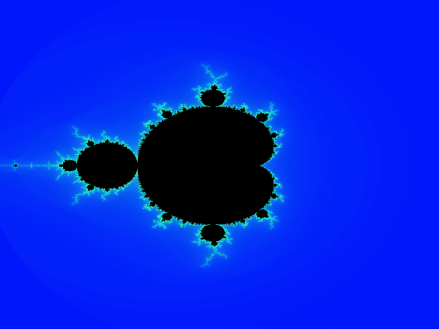
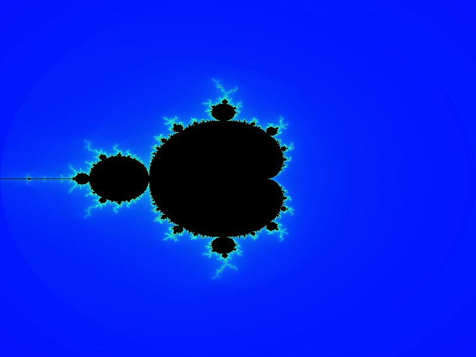
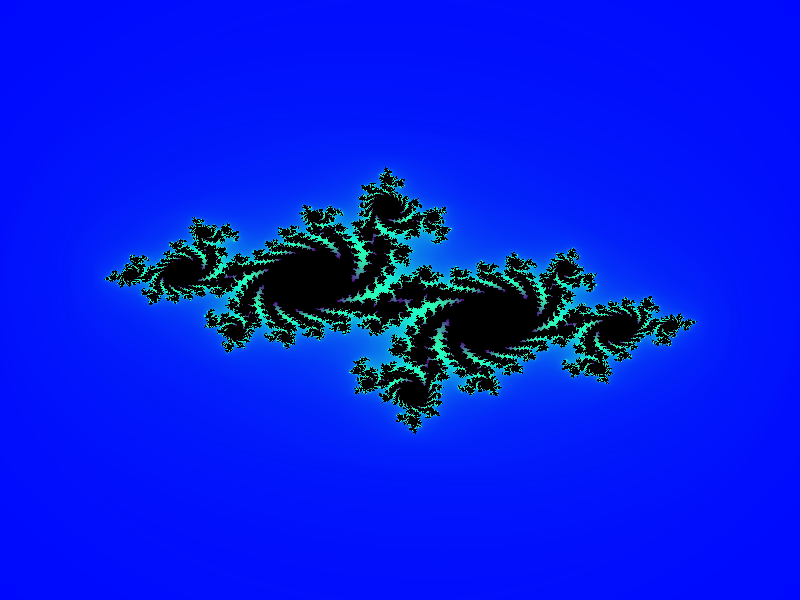
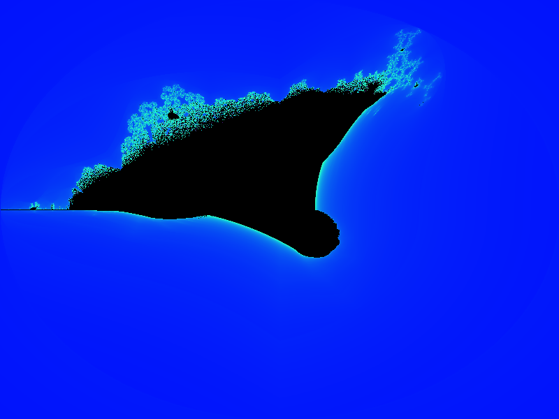
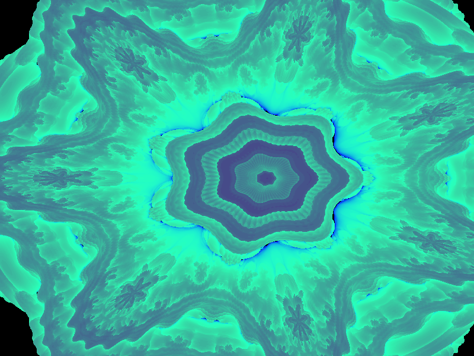
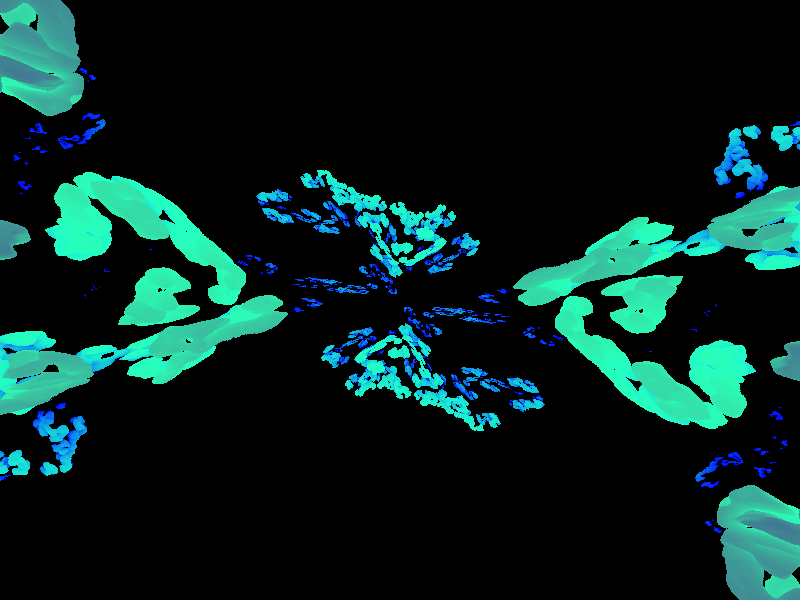

# fract-ol

A real-time fractal explorer written in C.

It renders the Mandelbrot and Julia sets — plus the Burning Ship and two 3D
variants — into an image buffer, then lets you zoom, pan, recolor and change
the iteration count interactively. The graphics backend is either
**MiniLibX** (X11) or **SampaLX**, a drop-in MiniLibX replacement built on
OpenGL 3.3 + GLFW. On top of SampaLX the project can also be compiled to
**WebAssembly / WebGL 2**, so the same code runs in a browser.



## Gallery

<p align="center">
  
  
</p>
<p align="center">
  
  
</p>
<p align="center">
  
</p>

## Features

- Five fractals: Mandelbrot, Julia, Burning Ship, Mandelbrot 3D and Julia 3D.
- Interactive zoom, pan, color cycling and adjustable iteration count.
- GPU-accelerated image blitting through SampaLX (OpenGL 3.3).
- A WebGL 2 / WebAssembly build powered by Emscripten that runs in the browser.
- Only MiniLibX/SampaLX, `libft` and a C compiler are required.

## Supported fractals

| Fractal | Argument |
| ------- | -------- |
| Mandelbrot | `mandelbrot` |
| Julia | `julia <c_real> <c_imag>` |
| Burning Ship | `burning_ship` |
| Mandelbrot 3D | `mandelbrot3d <power>` |
| Julia 3D | `julia3d <c_x> <c_y> <c_z>` |

## Building

### Requirements

- A C compiler (`cc`) and `make`.
- A graphics backend:
  - `master` branch: MiniLibX + X11 (`libx11-dev`, `libxext-dev`).
  - `SampaLX` branch: SampaLX + OpenGL/GLFW (`libglfw3-dev`, `libgl1-mesa-dev`).
- Optional, for the web build: [Emscripten](https://emscripten.org) (`emcc`, `emar`).

Clone the repository together with its submodules:

```sh
git clone --recurse-submodules git@github.com:herom-s/fract-ol.git
cd fract-ol
```

### Desktop

```sh
make            # builds ./fractol (Mandelbrot + Julia)
make bonus      # builds ./fractol with the full set (Burning Ship + 3D)
```

### Web (SampaLX / WebGL branch)

The web build lives on the `SampaLX` branch. Make sure `emcc` is on your
`PATH`, then:

```sh
make web        # non-bonus build  -> fractol.html
make web-bonus  # full set         -> fractol.html
```

The page must be served over HTTP (`file://` blocks the Wasm fetch):

```sh
python3 -m http.server 8000
# then open http://localhost:8000/fractol.html
```

Because a browser has no command line, the fractal is selected through the
`?args=` query string:

```
fractol.html?args=mandelbrot
fractol.html?args=julia,-0.7,0.27015
fractol.html?args=burning_ship
fractol.html?args=mandelbrot3d,2.0
fractol.html?args=julia3d,-0.7,0.27015,0.0
```

Click the canvas once so it gets keyboard focus. Use `make web-bonus` for the
Burning Ship and 3D fractals.

## Usage

```sh
./fractol mandelbrot
./fractol julia -0.7 0.27015
./fractol burning_ship
./fractol mandelbrot3d 2.0
./fractol julia3d -0.7 0.27015 0.0
```

Run `./fractol --help` for the full argument list.

## Controls

| Input | Action |
| ----- | ------ |
| Mouse wheel | Zoom in / out |
| `W` `A` `S` `D` / arrow keys | Move around the fractal |
| `+` / `-` | Increase / decrease the iteration count |
| `Q` | Change the color palette |
| `E` / `R` | Increase / decrease the color shift |
| `1`–`5` | Switch fractal type |
| `U` `H` `J` `K` | Rotate the 3D fractals |
| `Z` | Reset the view |
| `Esc` | Quit |

## Project structure

```
.
├── libft/          # C library submodule
├── minilibx/       # MiniLibX submodule (master branch)
├── SampaLX/        # OpenGL/GLFW MiniLibX replacement submodule (SampaLX branch)
├── web/            # Emscripten shell + argument shim (SampaLX branch)
├── assets/         # README images / GIFs
├── Makefile
└── *.c, *.h        # fract-ol sources (non-bonus and *_bonus)
```

## License

Released under the MIT License. See [LICENSE](LICENSE) for details.
